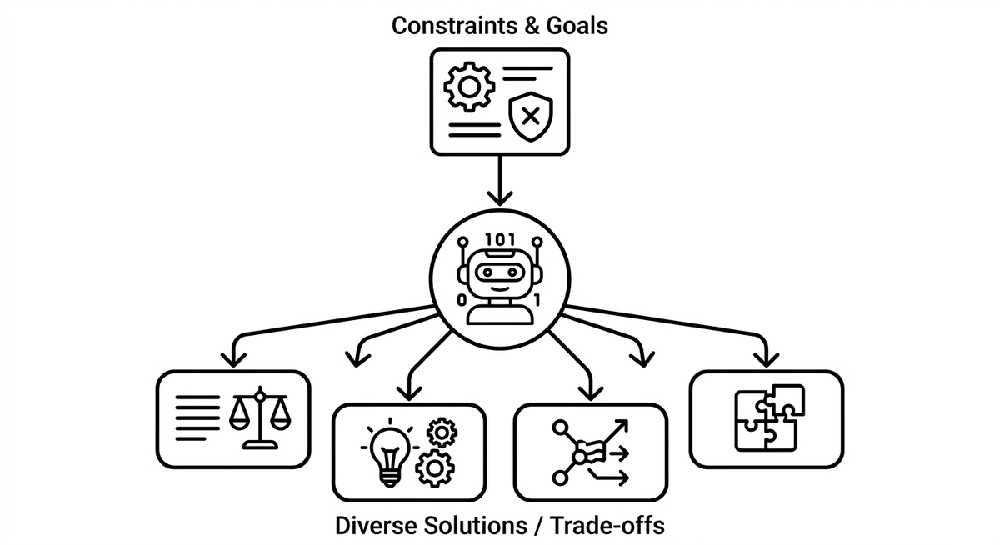

# Variant Generation

> The use of AI to produce multiple distinct solutions for a given problem rather than converging on a single answer. Teams supply context such as constraints, goals, and existing decisions, and the agent returns alternatives that each represent a different set of trade-offs. The value is in widening perspective before committing to a direction, not in automating the decision itself.

**See also:** [Context Engineering](context-engineering.md) · [Human-in-the-Loop](human-in-the-loop.md) · [Modernization Playbook](modernization-playbook.md)
{ .see-also }
