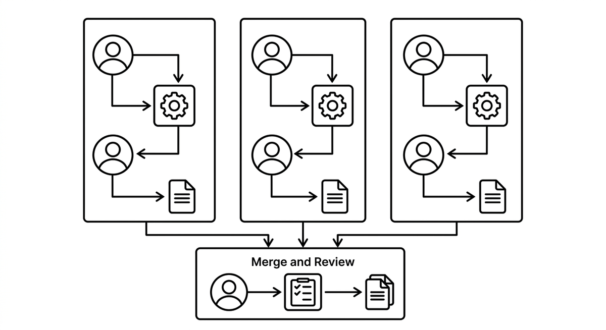

# Workflow Sharding

> A pattern for running many agents on one transformation with minimal coordination: divide the workload into independent shards, give each shard an isolated worktree, and let agents inside a shard proceed without ever needing to talk to another shard. Because shards share nothing, no orchestrator has to mediate between them, and total throughput scales roughly with the number of shards until merge conflicts and review capacity become the bottleneck. Used in large agent driven ports such as the Bun rewrite in Rust.

**See also:** [Slicing](slicing.md) · [Agent Teams](agent-teams.md) · [Porting Guide](porting-guide.md)
{ .see-also }
