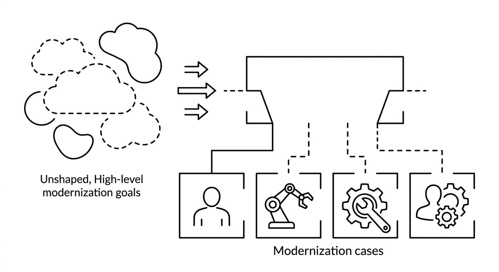

# Workload Design

> Defining the shape and boundaries of each work item in a modernization initiative, including whether it is performed by an agent, a human, other tools, or a combination of these. Workload design turns a high-level modernization goal into a set of modernization cases, each a concrete, assignable unit with clear ownership, tooling requirements, and success criteria.

**See also:** [Modernization Case](modernization-case.md) · [Modernization Playbook](modernization-playbook.md) · [Agent Runbook](agent-runbook.md) · [Slicing](slicing.md)
{ .see-also }
