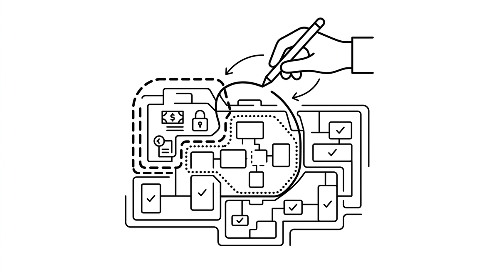

# Zones

> A risk map that a human draws over an older codebase before agents start working in it, marking areas as green (well tested, isolated, safe for a tight agent loop), yellow (mixed quality, requiring characterization tests before agents change anything), or red (sensitive logic such as authentication or billing that stays off limits or under constant human pairing). Left to explore on their own, agents gravitate toward the riskiest code first, since that is where the most interesting names live, which is exactly why the map has to be drawn by a person, not the agent.

**Reference:** [Brownfield Agentic Engineering](https://addyo.substack.com/p/brownfield-agentic-engineering) by Addy Osmani

**See also:** [Blast Radius](blast-radius.md) · [Characterization Test](characterization-test.md) · [Human-in-the-Loop](human-in-the-loop.md) · [Guardrails](guardrails.md)
{ .see-also }
